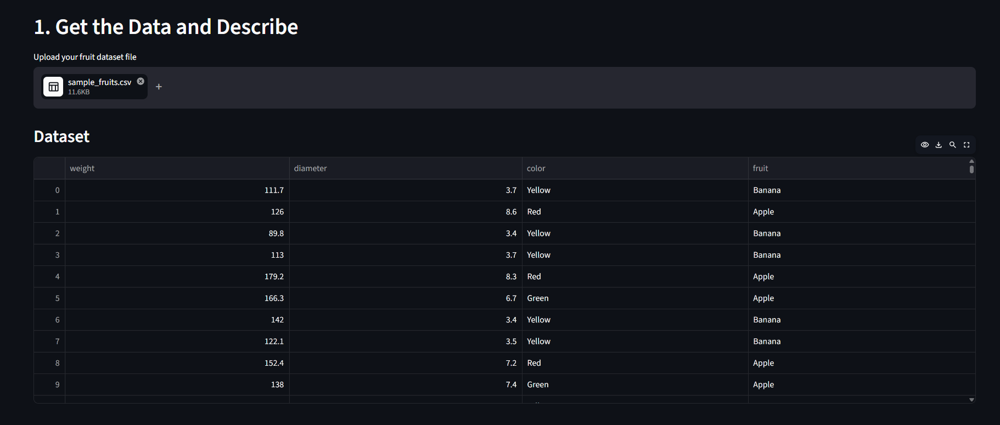
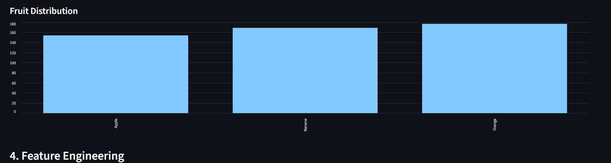

# 🍎 Fruit Classification using KNN

A beginner-friendly Machine Learning project that classifies fruits using the **K-Nearest Neighbors (KNN)** algorithm.

The application is built using **Python, Pandas, Scikit-learn, and Streamlit**.

## 🚀 Project Overview

This project predicts the type of fruit based on three input features:

* **Weight**
* **Diameter**
* **Color**

The target/output variable is:

* **Fruit**

The project also provides an interactive Streamlit interface where users can upload a CSV/Excel dataset and predict a new fruit.

## 🧠 Machine Learning Algorithm

### K-Nearest Neighbors (KNN)

KNN is a supervised machine learning classification algorithm.

For a new fruit, KNN:

1. Takes the new fruit's features.
2. Calculates the distance between the new fruit and training data.
3. Finds the nearest `K` data points.
4. Checks the fruit classes of those neighbors.
5. Uses the majority class to make the prediction.

For example, if `K = 3`:

```text
Neighbor 1 → Apple
Neighbor 2 → Apple
Neighbor 3 → Orange

Prediction → Apple
```

## 📊 Features Used

| Feature  | Description           |
| -------- | --------------------- |
| Weight   | Weight of the fruit   |
| Diameter | Diameter of the fruit |
| Color    | Color of the fruit    |

### Target Variable

```text
fruit
```

The model predicts whether the fruit is an Apple, Banana, Orange, or another class present in the dataset.

## 🔧 Data Preprocessing

The project performs the following preprocessing steps:

### 1. Missing Value Handling

The dataset is checked for missing values.

Incomplete rows are removed before model training.

### 2. Label Encoding

The `color` column contains text values such as:

```text
Red
Green
Yellow
Orange
```

KNN works with numerical data, so the color values are converted into numerical labels using `LabelEncoder`.

### 3. Train-Test Split

The dataset is divided into:

* 70% training data
* 30% testing data

The training data is used to build the model, while the testing data is used to evaluate it on unseen records.

### 4. Feature Scaling

`StandardScaler` is used because KNN is a distance-based algorithm.

Scaling puts the numerical features onto a comparable scale so that a feature with larger numerical values does not dominate the distance calculation.

## 🤖 Model Training

The KNN model is created using Scikit-learn:

```python
KNeighborsClassifier(n_neighbors=k)
```

The application allows the user to select the value of `K` using a Streamlit slider.

## 📈 Model Evaluation

The model is evaluated using:

* Accuracy
* Confusion Matrix
* Classification Report

The classification report includes:

* Precision
* Recall
* F1-score
* Support

## 🖥️ Application Screenshots

### Main Application



### Model Results



### New Fruit Prediction


## 🛠️ Technologies Used

* Python
* Pandas
* Scikit-learn
* Streamlit
* Excel/CSV
* Machine Learning

## 📁 Project Structure

```text
fruit-knn-classifier/
│
├── app.py
├── requirements.txt
├── sample_fruits.csv
├── README.md
│
└── screenshots/
    ├── main-app.png
    ├── model-results.png
    └── prediction.png
```

## ▶️ How to Run the Project

### 1. Clone the repository

```bash
git clone https://github.com/bcahelishapatel-commits/fruit-knn-classifier.git
```

### 2. Open the project folder

```bash
cd fruit-knn-classifier
```

### 3. Install the required libraries

```bash
pip install -r requirements.txt
```

### 4. Run the Streamlit application

```bash
streamlit run app.py
```

The application will open in your browser.

## 🎯 Learning Objectives

Through this project, I learned how to:

* Prepare a dataset for machine learning
* Separate input features and target variables
* Encode categorical data
* Split data into training and testing sets
* Apply feature scaling
* Build a KNN classification model
* Make predictions
* Evaluate a classification model
* Build an interactive ML application using Streamlit
* Upload and manage a project using GitHub

## 👩‍💻 Author

**Helisha Patel**

MCA Student | Aspiring Data Analyst / Data Scientist
